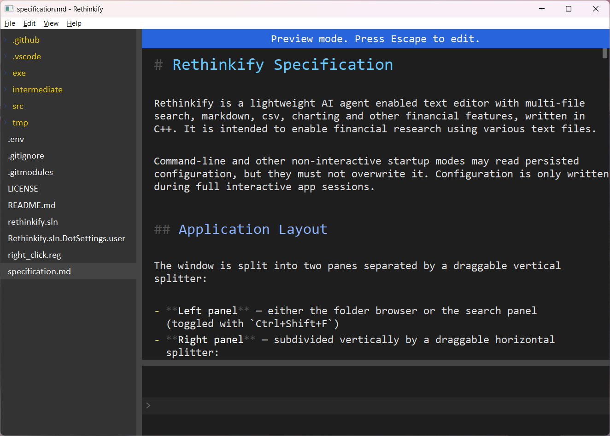

# Rethinkify

Rethinkify is a lightweight AI-agent-enabled text editor with multi-file search, Markdown, CSV, charting, and other financial features, written in C++. It is intended to support financial research using various text files.

Still a work in progress.

It has few dependencies and uses simple Win32 GDI rendering. It typically uses just a few megabytes of memory. I use it to manage a large collection of markdown reference documents for my financial research.

