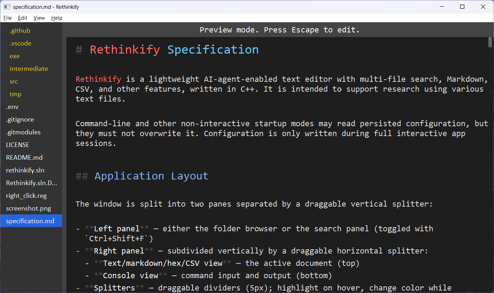

# Rethinkify Site

Personal site of Zac Walker — a single page covering his sites, open-source projects,
professional work and education.

Live at [rethinkify.com](https://rethinkify.com).



## Stack

A small Flask app on Google App Engine (Python 3.13 standard environment), served by
gunicorn. Server-rendered Jinja2, hand-written CSS, and no JavaScript at all — the
`Content-Security-Policy` in `web/main.py` sets `script-src 'none'`.

## Layout

```
web/
├── app.yaml           # App Engine config: runtime, scaling, static handlers
├── main.py            # Routes, security headers, asset versioning
├── requirements.txt
├── static/
│   ├── favicon.svg
│   ├── images/
│   └── styles.css
└── templates/
    ├── index.html     # The page
    ├── error.html     # 404 / 500
    └── sitemap.xml
```

## Routes

| Route | Purpose |
| --- | --- |
| `/` | The page |
| `/health` | `ok` (200) for uptime checks |
| `/robots.txt` | Generated, points at the sitemap |
| `/sitemap.xml` | Generated |
| `/favicon.ico` | Serves `static/favicon.svg` |

## Developing

```powershell
.\dd.ps1 run              # http://localhost:8081
.\dd.ps1 format           # Black
.\dd.ps1 format --check   # Black, no writes
```

`run` uses `.venv` if present; otherwise create one and
`pip install -r web/requirements.txt`.

## Deploying

```powershell
.\dd.ps1 deploy
```

Ships to the `rethinkify` App Engine project in `europe-west1`. The target project is
hard-pinned in `dd.ps1` so a misconfigured `gcloud config` cannot deploy elsewhere.
